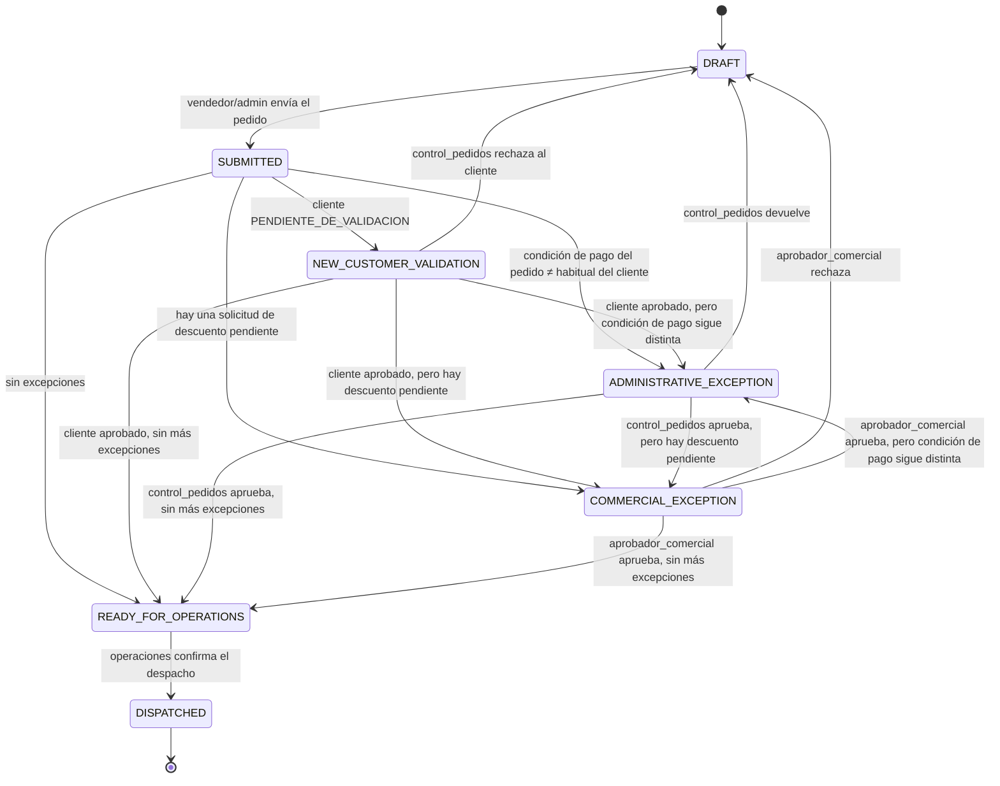

# Máquina de estados de pedidos

Este documento describe el flujo de un pedido desde que un vendedor (o un
administrador a nombre de un vendedor) lo arma hasta que queda listo para que
Operaciones lo despache. La autoridad real de estas reglas vive en
`supabase/migrations/0036_order_workflow_functions.sql` (funciones `SECURITY
DEFINER`); `domain/orders.ts` es un espejo en TypeScript para tests rápidos y
para dar feedback optimista en la UI — si alguna vez divergen, gana SQL.

## Diagrama de estados

`AUTOMATIC_VALIDATION` (el paso "bifurca" del PRD) **nunca se persiste como
fila en reposo** — es el momento, dentro de `pedidos.submit_order()` o
`pedidos.reevaluate_order()`, en que el servidor decide a cuál de los 4
estados finales corresponde el pedido. No hay que buscarlo en la base de
datos: si un pedido está `SUBMITTED`, es solo por la duración de una
transacción SQL, nunca algo que la UI llegue a mostrar.

## Tabla transición → rol → condición → efecto

| Transición | Quién la dispara | Condición | Queda en |
|---|---|---|---|
| `DRAFT → SUBMITTED` | vendedor dueño o admin | el pedido tiene al menos 1 línea | `order_status_history` |
| `SUBMITTED → NEW_CUSTOMER_VALIDATION` | automático (`submit_order`) | `customers.estado = PENDIENTE_DE_VALIDACION` | `order_status_history` |
| `SUBMITTED → ADMINISTRATIVE_EXCEPTION` | automático (`submit_order`) | `orders.payment_terms_id ≠ customers.condicion_pago_habitual_id` | `order_status_history` |
| `SUBMITTED → COMMERCIAL_EXCEPTION` | automático (`submit_order`) | existe `approval_requests` con `estado = PENDIENTE` para alguna línea | `order_status_history` |
| `SUBMITTED → READY_FOR_OPERATIONS` | automático (`submit_order`) | ninguna de las anteriores | `order_status_history` |
| `NEW_CUSTOMER_VALIDATION → DRAFT` | control_pedidos/admin | cliente rechazado | `order_status_history`, `customers.estado` |
| `NEW_CUSTOMER_VALIDATION → *` | control_pedidos/admin (vía `reevaluate_order`) | cliente aprobado | `order_status_history`, `customers.estado` |
| `ADMINISTRATIVE_EXCEPTION → DRAFT` | control_pedidos/admin | "devolver" | `order_status_history`, motivo |
| `ADMINISTRATIVE_EXCEPTION → ADMINISTRATIVE_EXCEPTION` | control_pedidos/admin | "observar" (no cambia estado) | `order_observations` |
| `ADMINISTRATIVE_EXCEPTION → *` | control_pedidos/admin (vía `reevaluate_order`) | "aprobar" | `order_status_history` |
| `COMMERCIAL_EXCEPTION → DRAFT` | aprobador_comercial/admin | `RECHAZAR` | `order_status_history`, `approval_decisions` |
| `COMMERCIAL_EXCEPTION → *` | aprobador_comercial/admin (vía `reevaluate_order`) | `APROBAR` / `APROBAR_OTRO_PRECIO` | `order_status_history`, `approval_decisions` |
| (sin cambio) | aprobador_comercial/admin | `SOLICITAR_INFO` | `order_observations` |
| `READY_FOR_OPERATIONS → DISPATCHED` | operaciones/admin (vía `confirm_dispatch`) | dirección de entrega activa, todas las líneas preparadas, lote/vencimiento capturados si el producto lo controla, motivo en toda diferencia de cantidad | `order_status_history`, `fulfillments`, `fulfillment_items`, `audit_logs` |

## `DISPATCHED`: qué exige y por qué es terminal

`pedidos.confirm_dispatch` (0046) hace todo en una sola transacción: valida,
crea el `fulfillment` con sus líneas, y recién entonces mueve el pedido. Si
una línea no cumple, no se crea el despacho ni se mueve el pedido — todo o
nada.

Lo que valida, en este orden:

1. **Rol**: solo `operaciones` o `administrador`. La función es SECURITY
   DEFINER y verifica el rol ella misma, así que la garantía se sostiene
   incluso llamando el RPC directamente sin pasar por la app.
2. **Estado**: solo desde `READY_FOR_OPERATIONS`. Esto es también lo que
   impide el doble despacho (el segundo intento encuentra `DISPATCHED`), con
   un índice único parcial en `fulfillments` como red de respaldo.
3. **Dirección de entrega activa.** Desde Fase 4 un pedido no puede enviarse
   sin dirección, así que todo lo que llegue acá ya debería tenerla; si un
   pedido legacy se cuela, se bloquea con un mensaje que dice qué hacer.
4. **Todas las líneas del pedido, exactamente una vez cada una.** No se
   despacha "lo que se acordó" — se despacha el pedido completo, aunque una
   línea vaya en cantidad 0.
5. **Lote y vencimiento** si `products.controla_lote` /
   `controla_vencimiento` lo exigen.
6. **Motivo obligatorio** en toda diferencia entre cantidad pedida y
   preparada. La diferencia queda en `fulfillment_items.motivo_diferencia` y
   en `audit_logs`.

`DISPATCHED` es terminal por ahora: no hay transición de salida hasta que
exista anulación de despacho, que no está en alcance.

**La fuente de stock la elige Operaciones acá, nunca el vendedor al tomar el
pedido.** Por eso `inventory_source_id` vive en `fulfillments` y no en
`orders`, y por eso el stock de fuentes distintas no se mezcla
automáticamente.

## Por qué no hay un atajo directo excepción → READY_FOR_OPERATIONS

Cuando se resuelve una excepción (cliente validado, excepción administrativa
aprobada, descuento aprobado), el pedido **vuelve a pasar por la misma lógica
de bifurcación**, no salta directo a `READY_FOR_OPERATIONS`. Esto maneja casos
compuestos sin duplicar lógica: por ejemplo, si un `aprobador_comercial`
aprueba un descuento pero la condición de pago del pedido sigue siendo
distinta de la habitual del cliente, el pedido cae en
`ADMINISTRATIVE_EXCEPTION` en vez de saltarse esa validación.

## Recálculo de precios: una sola vez

`pedidos.submit_order()` recalcula el precio de cada línea (contra
`price_list_items`/`product_tax_profiles` vigentes) **solo en la transición
`DRAFT → SUBMITTED`**. La reevaluación posterior (`pedidos.reevaluate_order()`)
nunca vuelve a tocar precios — si lo hiciera, sobrescribiría un precio que un
`aprobador_comercial` acaba de aprobar manualmente vía `APROBAR_OTRO_PRECIO`.

## TODOs explícitos para fases posteriores

Ninguno de estos puntos está implementado en Fase 4 — quedan anclados al
punto exacto donde deberían engancharse:

- **Stock real**: ya existe `stock_levels`, pero es un **registro manual**
  que mantiene Operaciones — no hay integración en tiempo real con un ERP de
  inventario, así que el número puede estar desfasado del almacén físico. Por
  eso el despacho **no bloquea** por falta de stock: avisa, y la línea se
  puede marcar como `pendiente_de_stock` con comentario. Cuando exista la
  integración, el gancho natural es reemplazar la lectura de `stock_levels`
  en `services/fulfillments.ts::getStockForOrder` y decidir ahí si pasa a ser
  bloqueante.
- **Promociones/bonificaciones**: `order_items`/`calculateLineItem` no
  contemplan escalas de precio ni bonificaciones — `products.codigo_bonificacion`
  ya se guarda desde Fase 2 para no perder el dato mientras tanto.
- **GRE (guía de remisión electrónica) y factura/boleta**: el gancho ya está
  marcado con un TODO explícito al final de `pedidos.confirm_dispatch` (0046),
  justo después de que el despacho quedó grabado y el pedido pasó a
  `DISPATCHED`. Va después y no antes a propósito: un fallo del proveedor no
  puede revertir un despacho físico ya hecho — mismo criterio que la
  notificación por correo al enviar el pedido. `customers.tipo_comprobante_permitido`
  ya decide cuál corresponde, y la emisión deberá quedar registrada con su
  propio estado, reintentable.
- **Anulación de despacho**: `DISPATCHED` es terminal. No hay forma de
  revertir un despacho confirmado; cuando haga falta, es una transición nueva
  con su propio permiso y su propio registro.
